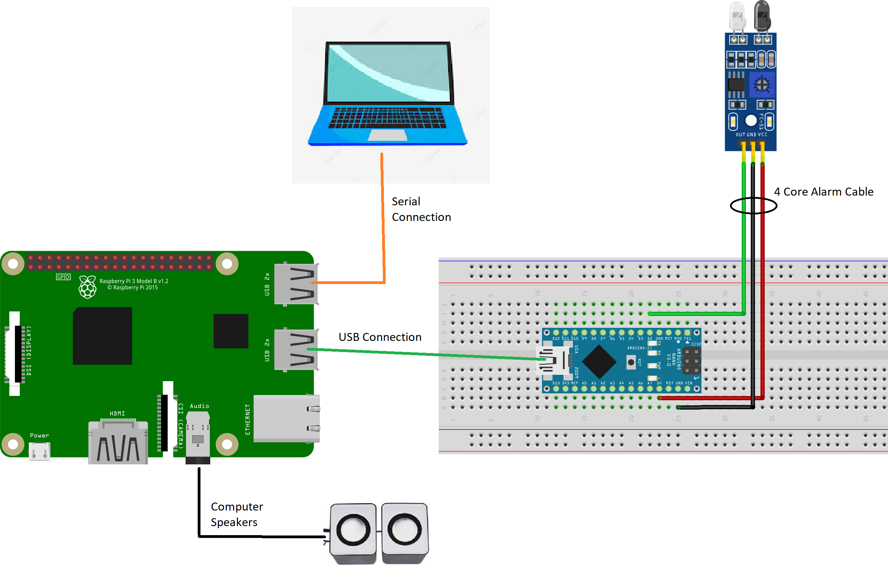
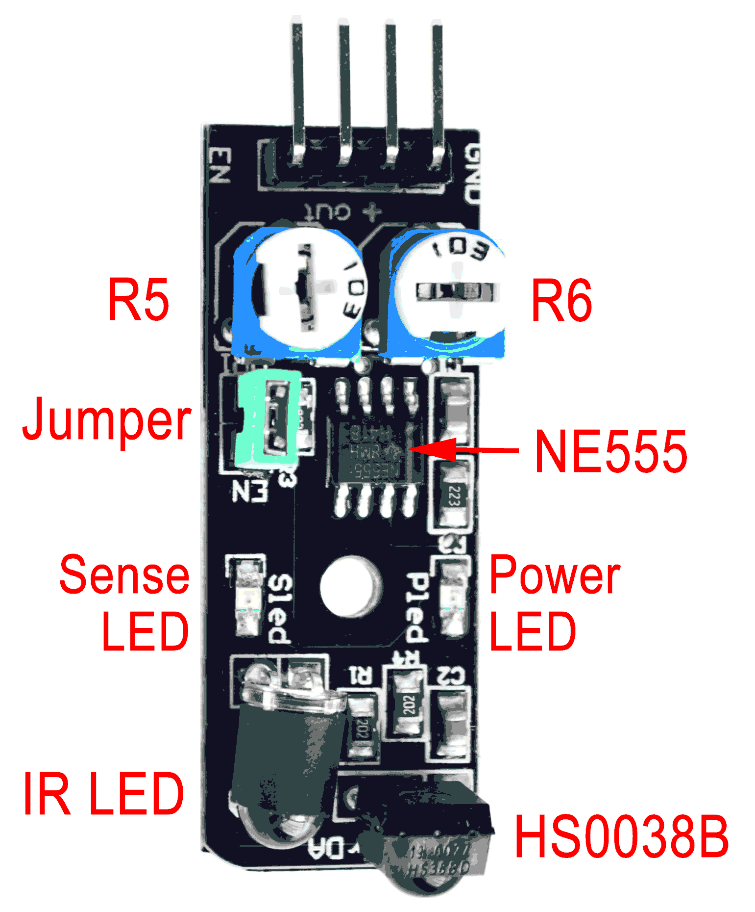
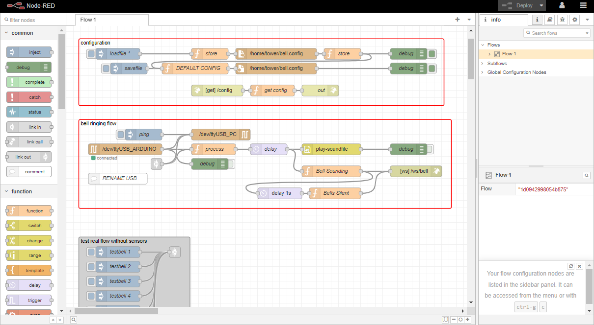
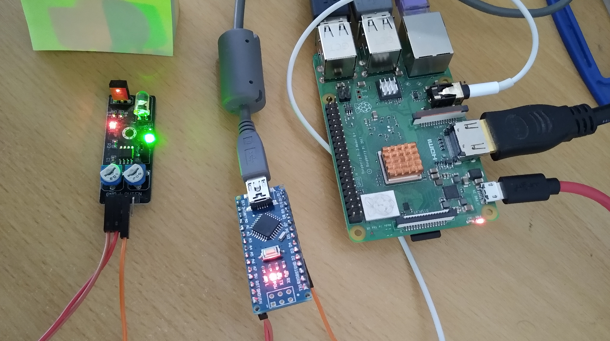

# BellTower Simulator
A simple bell tower simulator setup - for installation into a tower of church bells for silent ringing practice.

Main simulator flow  [Bell Sensor -> Arduino -> RaspberryPI -> Speakers]
 
plus optionally [RaspberryPI -> PC] for serial output to a pc or laptop running additional bell ringing software

<a href="photos">Photo Library</a> shows how this system has been installed in the Sherfield English tower in Hampshire UK.

The sensors being used are cheap and readily available KY-032 IR obstacle sensors (others could be used with changes to the Arduino code).  The KY-032 sensor is particularly good because R5 and R6 in the image below allow you to alter sensitivity and distance of detection. 

The Raspberry PI is connected to the Arduino via a USB cable therefore providing power to it.  The Arduino in turn also powers all the KY-032 sensors (they are very low power).  3 wires are required to each sensor - Ground, +5v and Sense.  The Ground and +5v can be shared from the Arduino to all the sensors but each sensor requires its own Sense wire run independently to the Arduino.  Therefore 8 bells require 10 wires from the Arduino to where the bells are hung.  Cheap multicore house alarm cable is recomended for this purpose

The Arduino monitors each Sense wire from the sensors via the Arduino pin it is connected to.  If the Sense pin changes then the bell has swung past the sensor and the audio sound should be triggered following a suitable delay in milliseconds.  

A simple NodeRed flow on the Raspberry PI is used to monitor the USB serial line comming from the Arduino - the Arduino outputs a sinlge character '1' to 'x' representing each bell sensor trigger.  The NodeRed flow uses the bell number to trigger the approviate audio wav file for that bell to be played.  The NodeRed flow also attempts to forward the same bell number ie '1' to 'x' to a second serial port so that optionally a computer/laptop can be used to run bell ringing software such as Virtual Belfry.

<h2>Raspberry PI Binary Image</h1>

If you have a Raspberry PI v3 B+ and at least an 8GB flash card then you can use the <a href="rpi3b">binary images</a> provided to fast start your setup.  You can use the <a href="https://www.raspberrypi.com/software/">Raspberry PI Imager</a> to install it on a suitable flash card

Once installed and successfully booted you will need the following id's and passwords
<list>
<li>Wifi AP is "belltower" with no password [default ip is 10.42.0.1]
<li>VNC access is enabled with user login "tower" and password "t0w3r"
<li>Raspbian user login is "tower" with password "t0w3r" [ssh remote access is also enabled for this id/pw]
<li>NodeRed login is "tower" with password "t0w3r"
</list>

Your PI should start up with the wifi AP belltower active. Connect to it and direct your browser to http:\\10.42.0.1 or http:\\tower

<h2>Raspberry PI Setup 1</h2>

Any version of a Raspberry PI is suitable for this purpose but one with a headphone socket is preferable
<list>
  <li>Install your preferred OS.. eg Raspberry Pi OS with desktop from https://www.raspberrypi.com/software/ with the user as "tower"
  <li>Follow the <a href="https://nodered.org/docs/getting-started/raspberrypi">instructions here to install NodeRed</a>
  <li>Log into NodeRed and import [<a href="nodered/flow.json">nodered/flow.json</a>]
  <li>Allow any library dependencies to be installed automatically as required
  <li>Plug speakers into the arduino headphone socket
  <li>Transfer your preferred bell sound files as "1.wav" etc to  /home/tower/.node-red/audio.. Check the nodered 'store' nodes to confirm that it correctly specifies the location of the audio files 
  <li>Use the Test flows to check that the audio files are played correctly
</list>

<h2>Arduino Setup</h2>
<list>
  <li>Install the Arduino IDE (on whatever machine is easiest.. it can be the raspberry pi)
  <li>Using the ArduinoIDE upload [<a href="arduinoKY032.ino">arduinoKY032.ino</a>] to a suitable device.. eg an <a href="https://www.teachmemicro.com/wp-content/uploads/2019/06/Arduino-Nano-pinout.jpg">Arduino Nano</a> 
</list>
Note: This code assumes an Arduino Nano but can easily be modified for other Arduino device.

<h2>Raspberry PI Setup 2</h2>
<list>
  <li>Connect test sensors to the Arduino as per the pin definitions in "arduinoKY032.ino".  FYI sensors do seem to have different sensitivy so we have adjusted them to be ~2cm pickup of a reflective surface to make tower installation easier
  <li>Plug the Arduino into the Raspberry PI
  <li>Follow the instructions <a href="https://www.freva.com/assign-fixed-usb-port-names-to-your-raspberry-pi/">here</a> to create symlinks to the Arduino serial port [ie no matter which USB the RPI is connected the arduino will always be addressable as /dev/ttyUSB_ARDUINO]
</list>

Desk test setup

<h2>Tower Installation</h2>
The <a href="photos">Photo Library</a> shows how this system has been installed in the Sherfield English tower in Hampshire UK.
<list>
  <li>The Raspberry PI and arduino are installed somewhere in the ringing chamber - out of the way but accessible - somewhere near a power switch to turn the whole lot on and off easily
  <li>8 core and 4 core alarm cable is used to run from the Arduino to where the bells hang (this is cheap and available in good lengths).  eg run 2*8core cables up to a central spot then 4 core to each bell
  <li>Attach each bell sensor to a convenient support aligned to each bell wheel. A short piece of wood helps with positioning and provides a secure cable tied base to install the sensor on.  Ensure nothing is going to catch the sensor as the bell swings
  <li>White duct tape can be used on the wheel to ensure good IR sensor reflectivity.  Tape ~15cm long reduces signal bouce when the wheel isnt quite stationary
</list>

<h2>Fine Tuning</h2>
<list>
  <li>Audio Delays - from sense to audio playing - see the NodeRed flow to introduce the appropriate delays per bell.  Running the simulator without the bells silenced lets you fine tune the simulator audio to the real bells
  <li>Bell Audio files - record your own bells!  A phone held out of a bell tower window seemed to do the trick and with a bit of online wav file hacking we've managed to create really good audio of the bells at Sherfield English
  <li>Add a USB serial adapter to the raspberry PI and using a second serial adapter connect the raspberry PI to a secondary laptop to run 3rd party ringing software eg <a href="https://www.belfryware.com/">Virtual Belfry</a>.  Note: when configured in the NodeRed flow the raspberry pi will output a single ascii character representing the bell number eg '1'.  This complies with the "Bagley Multi-Bell Interface" format <a href="https://www.abelsim.co.uk/doc/mbiconn.htm">described here</a>
  <li>Consider remote access to the Raspberry PI eg <a href="https://www.tomshardware.com/how-to/raspberry-pi-access-point">Wifi AP</a>
  <li>Consider how to easily update the Arduino code (eg install the Arduino IDE on the Raspberry PI)
  <li>Install apache2 and add a web homepage (eg <a href="index.html">index.html</a>)
  <li>Configure "httpStatic: '/home/tower/.node-red/www'" in the NodeRed config file and visualise the bells being rung (eg by adding the files <a href="nodered/index.html">nodered/index.html</a> and <a href="nodered/line.html">nodered/line.html</a> to the folder "/home/tower/.node-red/www")
</list>

<h2>Words of Wisdom</h2>
<list>
  <li>It turns out that bell wheels are definitely not all perfectly round or square!  Watch out for what this does to the sensor trigger/pickup.. we found in Sherfield English that this was a real game trying to get the sensor the right distance from the wheel and the sensor settings just right so that it only triggered once on the white tape as the wheel turned fully in either direction.  Some wheels were easy to get right but the bigger bells were tougher and may need ongoing adjustments.
  <li>In changing weather conditions we found that cable ties alone was not enough to hold the sensors perfectly in place. We decided to add 2 small M6 J bolts to each of the pieces of wood holding the sensors in order to clamp it more securely to the steel Ibeams.  The cable ties help get everything in about the right place to install the Jbolts then remain as a backup.
  <li>As the bells are initially rung up or in the final stages of ringing down, the simulator rings the bells very unnaturally fast as the sensor is triggered very quickly.  To remove this unnatural ringing we added a minimum trigger repeat wait to each bell within the NodeRed flow.  Setting this to 600ms means that the simulator stops ringing the bells until the triggers are more naturally spaced but still lets you practice ringing up and down to some degree.
</list>
