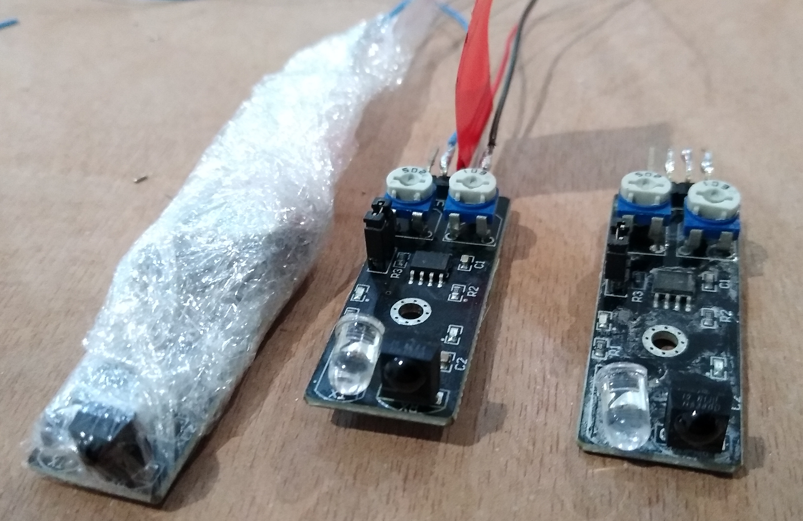

<H1>Photo Library</H1>

Sensor preparation - sensors with short wires soldered to them and wrapped in clingfilm (to help reduce the impact of moisture on the electronics) ready for installation in the tower

  

Desk test setup

  

Fitted sensors in the tower - this one point happens to be able to serve both bells which was fortunate

  

Cable install - cables are tied to the underside of the top of the I beams so that you can still stand on any of the beams in those tight spots without fear of pulling wires

